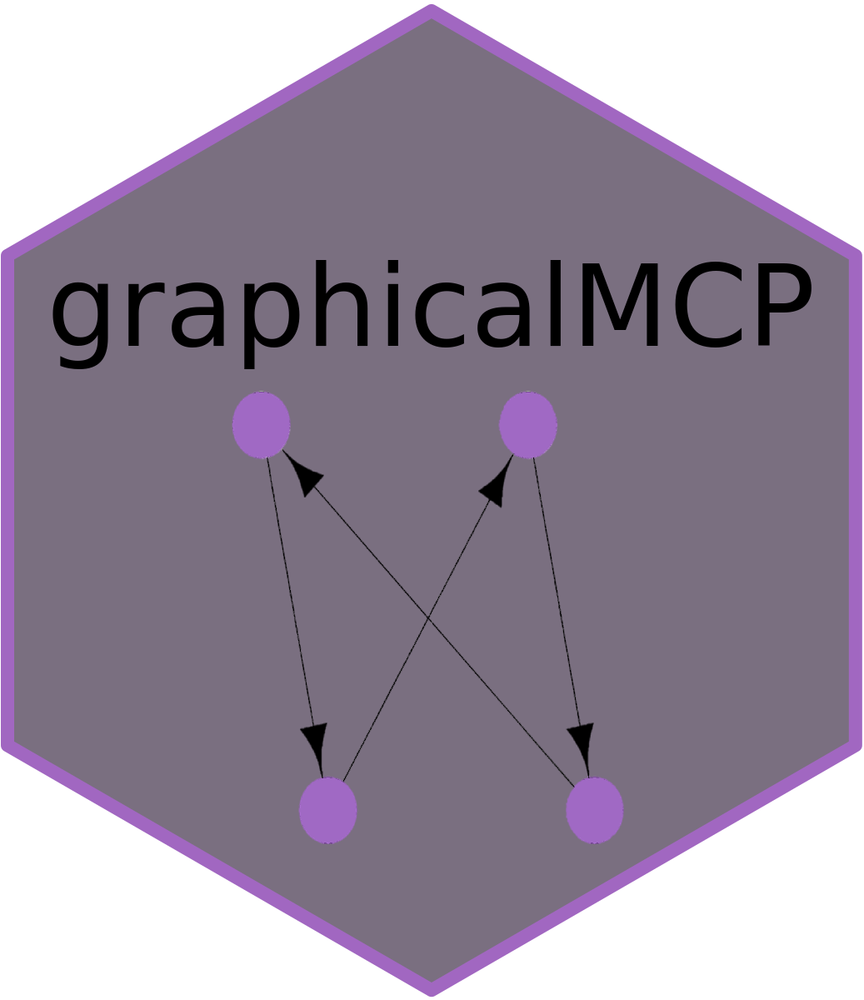

<!-- README.md is generated from README.Rmd. Please edit that file -->

```{r, include = FALSE}
knitr::opts_chunk$set(
  results = "hide",
  collapse = TRUE,
  comment = "#>",
  fig.path = "man/figures/README-",
  fig.align = "center"
)
```

<!-- badges: start -->

[](https://cran.r-project.org/package=graphicalMCP)

<!-- badges: end -->

# graphicalMCP <a href="https://urban-sniffle-p11zlpj.pages.github.io/"></a>

# Introduction

Graphical approaches for multiple comparison procedures (MCPs) are a general framework to control the family-wise error rate strongly at a pre-specified significance level $0<\alpha<1$. This approach includes many commonly used MCPs as special cases and is transparent in visualizing MCPs for better communications. `graphicalMCP` is designed to design and analyze graphical MCPs in a flexible, informative and efficient way.

# Installation

`graphicalMCP` is currently not on CRAN but can be installed from GitHub using the following code:

```{r eval = FALSE}
# install.packages("pak")
pak::pak("Gilead-BioStats/graphicalMCP@dev")
```

# Documentation
- For basic usage instructions, see `vignette("graphicalMCP")`
- To become familiar with graphical MCP terminologies, see `vignette("glossary")`
- To learn examples of how to use `graphicalMCP`,
  - see `vignette("shortcut-testing")` for sequentially rejective graphical multiple comparison procedures based on Bonferroni tests
  - see `vignette("closed-testing")` for graphical multiple comparison procedures based on the closure principle
  - see `vignette("graph-examples")` for common multiple comparison procedures illustrated using `graphicalMCP`
  - see `vignette("generate-closure")` for rationales to generate the closure and the weighting strategy of a graph
  - see `vignette("comparisons")` for comparisons to other R packages

# Related work

- Graphical MCPs - [gMCP](https://cran.r-project.org/package=gMCP)
- Lighter version of `gMCP` which removes the rJava dependency - [gMCPLite](https://cran.r-project.org/package=gMCPLite)
- Graphical MCPs with Simes tests - [lrstat](https://cran.r-project.org/package=lrstat)

Built upon these packages, we hope to implement graphical MCPs in a more general framework, with fewer dependencies and simpler S3 classes, and without losing computational efficiency.

# Acknowledgments

Along with the authors and contributors, thanks to the following people for their suggestions and inspirations on the package:

Frank Bretz, Willi Maurer, Ekkehard Glimm, Nan Chen, Jeremy Wildfire, Spencer Childress, Colleen McLaughlin, Matt Roumaya, Chelsea Dickens, and Ron Yu

We owe a debt of gratitude to the authors of [gMCP](https://cran.r-project.org/package=gMCP) for their pioneering work, without which this package would not be nearly as extensive as it is.
