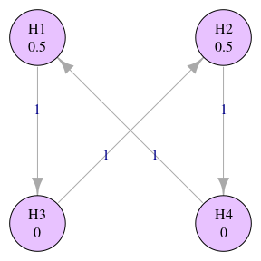

<!-- README.md is generated from README.Rmd. Please edit that file -->
<!-- badges: start -->

[](https://cran.r-project.org/package=graphicalMCP)
[](https://app.codecov.io/gh/Gilead-BioStats/graphicalMCP?branch=s3-graph_mcp)
[%60)](https://github.com/Gilead-BioStats/graphicalMCP/actions/workflows/R-CMD-check.yaml)

<!-- badges: end -->

# graphicalMCP 

# Introduction

A multiple comparison procedure (MCP) is a statistical analysis method
that allows for assessing the efficacy of multiple endpoints, some of
which are dependent on each other, in a single clinical trial. Endpoints
can be different doses, treatment of different conditions, combined
superiority & non-inferiority testing, or many others. A key feature is
that MCPs strongly control the type-I error rate at level alpha.

In (Bretz et al. 2011), a graphical method for MCPs is described, which
separates the weighting of the clinical endpoints from the particular
statistical test used to assess each endpoint. A graphical approach can
also be helpful for communicating study design to clinical teams. This
package is a low-dependency implementation of those methods.

# Installation

graphicalMCP is not on CRAN, so install it from GitHub with

``` r
# install.packages("pak")
pak::pak("Gilead-BioStats/graphicalMCP@dev")
```

# Basic usage

## Initial graph

The base object in graphicalMCP is an `initial_graph`, which is a
weighted, directed graph represented by a matrix of transition (edge)
weights, and a vector of hypothesis (vertex) weights.

``` r
library(graphicalMCP)

# A graphical multiple comparison procedure with two primary hypotheses (H1
# and H2) and two secondary hypotheses (H3 and H4)
# See Figure 1 in Bretz, F., Posch, M., Glimm, E., Klinglmueller, F., Maurer,
# W., & Rohmeyer, K. (2011). Graphical approaches for multiple comparison
# procedures using weighted Bonferroni, Simes, or parametric tests. Biometrical
# Journal, 53(6), 894-913.
hypotheses <- c(0.5, 0.5, 0, 0)
transitions <- rbind(
  c(0, 0, 1, 0),
  c(0, 0, 0, 1),
  c(0, 1, 0, 0),
  c(1, 0, 0, 0)
)

hyp_names <- c("H1", "H2", "H3", "H4")
example_graph <- graph_create(hypotheses, transitions, hyp_names)

example_graph

plot(example_graph, layout = "grid", vertex.size = 60)
```



## Update graph

Hypotheses can be deleted from the MCP using `graph_update()`. Updated
weights and transitions are calculated according to the weighting
strategy in Algorithm 1 of (Bretz et al. 2011). We distinguish
*deleting* from *rejecting* in the [glossary](#glossary-of-terms).

``` r
updated_example <- graph_update(example_graph,
                                delete = c(FALSE, TRUE, TRUE, FALSE))

updated_example

plot(updated_example)
```


## Generate weights

The weights of all sub-graphs can be calculated with
`graph_generate_weights()`. This uses more efficient code under the hood
than `graph_update()` in order to be performant for larger graphs.

``` r
graph_generate_weights(example_graph)
```

More information on the closure can be found in
`vignette("generate-closure")`.

## Test hypotheses

Bonferroni testing via the shortcut method is supported in graphicalMCP.
Such a test can be performed with `graph_test_shortcut()`, which
generates a report showing the graph & test results. See more insight
about why a hypothesis was rejected or not by setting the `verbose` and
`test_values` flags. More details about shortcut testing can be found in
`vignette("shortcut-testing")`.

``` r
graph_test_shortcut(example_graph, p = c(.01, .03, .02, .01), alpha = .025)
```

A graph can also be tested using Simes- or parametric-based testing
using the closure test. Other types of tests will be added over time,
and a combination of tests can be used for groups of hypotheses.
Additional details about closure testing can be found in
`vignette("closed-testing")`.

``` r
graph_test_closure(
  example_graph,
  p = c(.01, .03, .02, .01),
  alpha = .025,
  test_types = "bonferroni",
  test_groups = list(1:4)
)
```

## Power simulations

It’s not always obvious from a graph structure how easy or difficult it
will be to reject each hypothesis. One way to understand this better is
to run a power simulation, where many p-values are simulated, and a
graph is tested against each.

``` r
graph_calculate_power(
  example_graph,
  sim_n = 1e5,
  power_marginal = c(.9, .9, .8, .8)
)
```

All valid test types & hypothesis groupings are valid for power
simulations as well. Power simulations are discussed further in both the
`vignette("shortcut-testing")` and the `vignette("closed-testing")`.

# Related work

These methods were originally implemented in the [gMCP
package](https://github.com/kornl/gMCP), which is still available on
CRAN today. There is also a lighter version of gMCP implemented in
[gMCPmini](https://github.com/allenzhuaz/gMCPmini) and its successor,
[gMCPLite](https://github.com/Merck/gMCPLite). These two contain only a
subset of the original functionality, but they remove the rJava
dependency and add plotting functionality based on ggplot2.

However, because development has ceased on the original package, we hope
to re-implement the methods with a more general testing framework; with
fewer dependencies, in particular shedding the Java dependency; with
simpler, more transparent S3 classes; and with improvements to the
accuracy of the parametric and Simes test methods.

A portion of Simes testing is also implemented in the lrstat package.

# Citation

``` r
citation("graphicalMCP")
#> 
#> To cite graphicalMCP in publications use:
#> 
#>   Xi, D.; Brockmann, E. (2023). graphicalMCP: Graph-based multiple
#>   comparison procedures. version 0.1.0. Gilead Sciences, Inc. Foster
#>   City, California. https://github.com/Gilead-BioStats/graphicalMCP
#> 
#>   Frank Bretz, Martin Posch, Ekkehard Glimm, Florian Klinglmueller,
#>   Willi Maurer, Kornelius Rohmeyer (2011), Graphical approaches for
#>   multiple comparison procedures using weighted Bonferroni, Simes or
#>   parametric tests. Biometrical Journal 53 (6), pages 894--913, Wiley.
#> 
#> To see these entries in BibTeX format, use 'print(<citation>,
#> bibtex=TRUE)', 'toBibtex(.)', or set
#> 'options(citation.bibtex.max=999)'.
```

# Acknowledgments

We owe a debt of gratitude to the authors of gMCP for their pioneering
work in the field, without which this package would not be nearly as
extensive as it is.

# Glossary of terms

This package seeks to be both accurate and performant, of course. But
beyond that, much thought has been put into the readability of the code.
Whether being read by a user validating our methods, a developer
extending the package to new uses, or a contributor helping enhance the
core functionality, we hope that the code contained here can serve as an
educational document to grow people’s understanding of the graphical
approach to multiple comparison procedures.

To that end, there are several entities encountered in the world of
graphical MCPs that we define here. Some of these are used only in the
internal code of the package, but most are inputs or output in one or
more exported functions. If you believe any definitions could be
clarified or improved, please contact the package authors or submit an
issue to the GitHub repository.

<table style="width:99%;">
<colgroup>
<col style="width: 9%" />
<col style="width: 59%" />
<col style="width: 11%" />
<col style="width: 9%" />
<col style="width: 9%" />
</colgroup>
<thead>
<tr class="header">
<th>Entity</th>
<th>Definition</th>
<th>Aliases</th>
<th>Variable(s)</th>
<th>Related</th>
</tr>
</thead>
<tbody>
<tr class="odd">
<td><strong>Graph</strong></td>
<td>A set of nodes and edges representing a clinical trial design</td>
<td></td>
<td><code>graph</code></td>
<td>Hypotheses, Transitions</td>
</tr>
<tr class="even">
<td></td>
<td><strong>Graphs</strong> are so central that two of their core
qualities get their own common variable names: Hypothesis names, and
number of hypotheses</td>
<td></td>
<td><code>hyp_names</code>, <code>num_hyps</code></td>
<td></td>
</tr>
<tr class="odd">
<td><strong>Hypotheses</strong></td>
<td>The weighted nodes in a <strong>graph</strong>. Each node represents
a null hypothesis corresponding to a treatment endpoint, and its weight
the local significance level.</td>
<td>weights, hypothesis weights</td>
<td><code>hypotheses</code></td>
<td>Weighting strategy, Transitions</td>
</tr>
<tr class="even">
<td><strong>Transitions</strong></td>
<td>The weighted edges in a <strong>graph</strong>. Each edge defines
how to propagate local significance when a source node is deleted.</td>
<td></td>
<td><code>transitions</code></td>
<td>Hypotheses</td>
</tr>
<tr class="odd">
<td><strong>Intersection</strong> <strong>hypothesis</strong></td>
<td>A subset of <strong>hypotheses</strong> from a
<strong>graph</strong>. Plural often implies all such subsets.</td>
<td>intersection, sub-graph(s), closure</td>
<td><code>intersections</code></td>
<td>Weighting strategy</td>
</tr>
<tr class="even">
<td><strong>Weighting strategy</strong></td>
<td>The set of all <strong>intersections</strong> and their
<strong>weights</strong> according to Algorithm 1 in Bretz et al
(2011)</td>
<td>intersection weights, closure weights</td>
<td><code>weighting_strategy</code></td>
<td></td>
</tr>
<tr class="odd">
<td><strong>Adjusted weights</strong></td>
<td><p>The set of <strong>weights</strong>, adjusted according to a
testing algorithm:</p>
<ul>
<li>Bonferroni: No change</li>
<li>Simes: Sum weights for hypotheses with smaller p-values</li>
<li>Parametric: Multiply weights by c-value, based on the joint
distribution</li>
</ul></td>
<td></td>
<td><code>adjusted_weights</code></td>
<td></td>
</tr>
<tr class="even">
<td><strong>P-values</strong></td>
<td>The set of p-values from a real or simulated clinical trial</td>
<td></td>
<td><code>p</code></td>
<td>Adjusted &amp; ordered p-values</td>
</tr>
<tr class="odd">
<td><strong>Ordered p-values</strong></td>
<td><strong>P-values</strong> sorted from smallest to largest</td>
<td></td>
<td><code>ordered_p</code></td>
<td>(Adjusted) P-values</td>
</tr>
<tr class="even">
<td><strong>Adjusted p-values</strong></td>
<td><strong>P-values</strong> that have been divided by <strong>adjusted
weights</strong>, allowing direct comparison to <strong>alpha</strong>
to determine significance</td>
<td></td>
<td><code>adjusted_p</code></td>
<td>(Ordered) P-values</td>
</tr>
<tr class="odd">
<td><strong>Significance level</strong></td>
<td>The threshold chosen for results of a clinical trial to be
considered significant</td>
<td></td>
<td><code>alpha</code></td>
<td>P-values</td>
</tr>
<tr class="even">
<td><strong>Test types</strong></td>
<td>A specification of which testing algorithm to use - Bonferroni,
Simes, and parametric are supported</td>
<td>tests</td>
<td><code>test_types</code></td>
<td>Testing strategy</td>
</tr>
<tr class="odd">
<td><strong>Test groups</strong></td>
<td>A partition of nodes in a <strong>graph</strong> specifying which
<strong>hypotheses</strong> should be tested together</td>
<td>groups</td>
<td><code>groups</code>, <code>test_groups</code></td>
<td>Testing strategy</td>
</tr>
<tr class="even">
<td><strong>Testing strategy</strong></td>
<td><strong>Test types</strong> and <strong>test groups</strong>
combined</td>
<td></td>
<td></td>
<td></td>
</tr>
<tr class="odd">
<td><strong>Marginal power</strong></td>
<td><p>The power to reject each null <strong>hypothesis</strong> at full
<strong>alpha</strong>. Closely related to the non-centrality parameter,
which is the mean of each null <strong>hypothesis</strong> in the
underlying multivariate normal distribution:</p>
<p><code>ncp = qnorm(1 - alpha) - qnorm(1 - marginal_power)</code></p></td>
<td></td>
<td><code>marginal_power</code></td>
<td>Correlation matrix</td>
</tr>
<tr class="even">
<td><strong>Correlation matrix</strong></td>
<td>Specification of correlations between <strong>hypotheses</strong>.
Together with <strong>marginal power</strong>, this specifies the (known
or assumed) underlying multivariate normal distribution of the null
<strong>hypotheses</strong>.</td>
<td></td>
<td><code>corr</code>, <code>test_corr</code>,
<code>sim_corr</code></td>
<td>Marginal power</td>
</tr>
<tr class="odd">
<td><strong>Success</strong></td>
<td>A specification of which null <strong>hypotheses</strong> must be
rejected to consider a clinical trial a success</td>
<td></td>
<td><code>sim_success</code></td>
<td></td>
</tr>
<tr class="even">
<td><strong>Power</strong></td>
<td>Under a given <strong>graph</strong>, <strong>testing
strategy</strong>, <strong>significance level</strong>, and underlying
distribution, the estimated likelihood that a particular combination of
null hypotheses will be rejected</td>
<td></td>
<td><code>power_*</code></td>
<td>Success</td>
</tr>
<tr class="odd">
<td><em>Delete a <strong>hypothesis</strong></em></td>
<td>Remove a <strong>hypothesis</strong> from a graph, and update the
graph according to algorithm 1 of Bretz et al. (2011)</td>
<td></td>
<td>N/A</td>
<td>Reject a hypothesis</td>
</tr>
<tr class="even">
<td><em>Reject a <strong>hypothesis</strong></em></td>
<td>Under a given <strong>graph</strong>, <strong>testing
strategy</strong>, and <strong>significance level</strong>, find a
hypothesis (clinical endpoint) to be statistically significant, such
that the null hypothesis can be rejected</td>
<td></td>
<td></td>
<td>Delete a hypothesis</td>
</tr>
</tbody>
</table>

# References

<div id="refs" class="references csl-bib-body hanging-indent">

<div id="ref-bretz-2011" class="csl-entry">

Bretz, Frank, Martin Posch, Ekkehard Glimm, Florian Klinglmueller, Willi
Maurer, and Kornelius Rohmeyer. 2011. “Graphical Approaches for Multiple
Comparison Procedures Using Weighted Bonferroni, Simes, or Parametric
Tests.” *Biometrical Journal* 53 (6): 894–913.
<https://onlinelibrary.wiley.com/doi/10.1002/bimj.201000239>.

</div>

</div>
