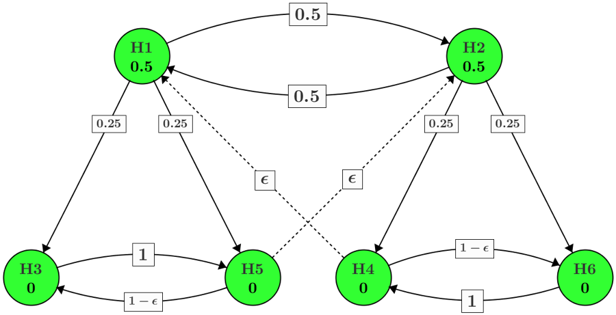

```{r, include = FALSE}
knitr::opts_chunk$set(
  collapse = TRUE,
  comment = "#>"
)
```

```{r setup, message=FALSE, warning=FALSE}
library(graphicalMCP)
library(ggplot2)
library(dplyr)
library(here)
library(gMCP)
library(gt)
```

# Overview {#overview}

Multiple comparison procedures are used in clinical trials to test multiple endpoints in a single trial, while strongly controlling the Type-I error rate at level alpha. {graphicalMCP} can be used at a couple different points in the clinical trial process. First, an [Initial graph](#initial-graph) must be chosen based on study design. The hypothesis and transition weights need not be settled, but the number of hypotheses will be chosen based on the study design. Then a [Power calculation](power-calculations) can be done to explore the likelihood of finding significant results, given a particular graph design, testing strategy, and assumed underlying distribution. In practice, this underlying distribution assumption will need to be well-supported by prior studies or other preliminary results. The power calculation should generally take place long before a study actually begins, as part of the approval to initiate the study. Finally once study data has been collected, the results can be [tested](study-data) according to one of a few different testing strategies. Currently implemented testing strategies include Bonferroni-based procedures (e.g., fixed sequence, Holm, fallback), Simes-based procedures (e.g., Hommel), parametric procedures (e.g., Dunnett), and more (e.g., some gate-keeping procedures). More procedures will be added over time, such as Hochberg or Fisher's combination.

# Initial graph {#initial-graph}

This vignette demonstrates testing and power calculations for a moderately complex graph example. We'll follow a hypothetical study for a new diabetes treatment at two dose levels. Each dose level is tested at three endpoints - Mean change in A1C level against placebo as the primary endpoint, and mean time-in-range and retinopathy progression against placebo as the secondary endpoints. Study sample size is 600, with participants spread equally across each dose level and placebo.

The initial weight should be split between the primary hypotheses, and each secondary hypothesis should only be tested if the corresponding primary hypothesis can be rejected. Weight from one dose group should certainly be passed to the other dose group if all of one dose is rejected. But scenarios will be explored where some weight is passed directly between primary hypotheses as well.

These requirements result in the graph below: Two different doses at three different outcomes being tested, which results in 6 distinct endpoints for testing. The `gamma` parameter can be set to control how much weight is passed between primary hypotheses vs how much is passed to the secondary groups (`1 - gamma`). The `hyp_1` parameter controls the initial weight of hypothesis 1, low dose A1C. The rest of the initial weight, `1 - hyp_1`, is assigned to hypothesis 2, high dose A1C.

```{r initial-graph}
hyp_names <- c("lo_a1c", "hi_a1c", "lo_tir", "hi_tir", "lo_ret", "hi_ret")

motivating_example <- function(hyp_1, gamma, names = hyp_names) {
  eps <- .0001

  hypotheses <- c(hyp_1, 1 - hyp_1, 0, 0, 0, 0)

  transitions <- rbind(
    c(0, gamma, (1 - gamma) / 2, 0, (1 - gamma) / 2, 0),
    c(gamma, 0, 0, (1 - gamma) / 2, 0, (1 - gamma) / 2),
    c(0, 0, 0, 0, 1, 0),
    c(eps, 0, 0, 0, 0, 1 - eps),
    c(0, eps, 1 - eps, 0, 0, 0),
    c(0, 0, 0, 1, 0, 0)
  )

  graph_create(hypotheses, transitions, hyp_names)
}

g_complex <- motivating_example(.75, .99)

print(g_complex)
```

[Need to decide whether to bring in plotting function at this point or not]



# Test design {#test-design}

In this section we'll lay out some possible testing strategies. A testing strategy is necessary to choose before running a power calculation because it's used to test each simulation. For more on using a testing strategy on actual study data, see [Test Execution](#test-execution) below.

## Bonferroni {#test-design-bonferroni}

A graph can be tested most simply with a Bonferroni testing method. A pure Bonferroni method is simple, it runs quickly, and it conservatively controls the family-wise error rate (FWER) at level alpha [citation needed]. As a result of the Bonferroni method being the most conservative of the methods implemented in this framework, it is less likely to return significant results at level alpha than some other testing methods.

Besides Bonferroni, the parametric and Simes class of testing strategies have been implemented currently.

## Parametric-Bonferroni {#test-design-parametric-bonferroni}

We can take advantage of the correlation between doses by testing the primary hypotheses together in a parametric group. Correlation between doses at the same endpoint reduces to 0.5 with equal randomization [similar statement to Xi unpublished (2023?)]. For each parametric testing group the joint distribution must be fully specified. In this case the correlations between doses for the same outcome measure are known, but all other correlations are unknown.

```{r test-corr}
rho_com_end <- .5

t_corr <- rbind(
  c(1, rho_com_end, NA, NA, NA, NA),
  c(rho_com_end, 1, NA, NA, NA, NA),
  c(NA, NA, 1, rho_com_end, NA, NA),
  c(NA, NA, rho_com_end, 1, NA, NA),
  c(NA, NA, NA, NA, 1, rho_com_end),
  c(NA, NA, NA, NA, rho_com_end, 1)
)
```

Using testing methods other than Bonferroni adds power to reject more hypotheses as a result of these other methods being less conservative in controlling the Type-I error rate, but they comes with a speed cost. This is barely noticeable for a single test, but it does slow things down for power calculations. [link to speed vignette, if we keep it around]

## Parametric-Simes {#test-design-parametric-simes}

Beyond the parametric group for primary hypotheses, it may make sense to test each pair of secondary hypotheses as a Simes group. Simes testing adds power compared to Bonferroni, but it requires non-negative dependency. In this example, the magnitude of the power increase from Simes testing depends on `gamma`, which may not be intuitive.

These are some of the test designs we can consider for the power calculation. Using them for testing actual study data, along with example data and code, is detailed in [Test execution](#test-execution) below.

# Power calculations {#power-calculations}

Even with an initial graph and an assumed underlying joint distribution, it can be difficult to tell how likely each hypothesis is to be rejected because the propagation of weights is not always obvious, and there are subtle interactions between hypothesis weights, edge weights, the test algorithm chosen, and the underlying joint distribution between hypotheses. One way to understand this better is to run a power simulation. The essence of a power simulation is to generate many different p-values using an assumed distribution, then test the graph against each set of p-values to see how it performs. In most cases, power will be calculated under many different scenarios to better understand the testing space.

The p-values for a power simulation are sampled from a multivariate normal distribution using a one-sided test. The means of the MVN are set equal to the marginal power of each hypothesis, and the correlations should be the correlation between hypotheses that are either known from the study design or assumed.

There are a couple differences between the correlation matrix used in parametric testing (`test_corr`) and the correlation matrix used in power simulations (`sim_corr`). Since the testing correlation is used on clinical data and can improve the chance of finding significant results, the values used should almost always be known, not assumed. If certain correlations are unknown, missing values should be used. However for sampling from the MVN distribution for a power simulation, all correlations must have a value. Any entries which are unknown must be assumed, and these assumptions should be tested for sensitivity across different power scenarios. It's also possible that some known correlations will be sensitivity tested to see the impact in the event that they are wrong.

## Parameter space

In order to run a power simulation, several parameters must be set. We'll divide these parameters into two categories: static and dynamic. Static parameters are more likely to be set once for a given study, while dynamic parameters are more variable.

-   Static
    -   `alpha` - Significance level
    -   `test_groups`/`test_types`/`test_corr` - Testing strategy
    -   `sim_n` - Number of simulations to run for power calculations
    -   `sim_success` - Definition of success for the trial
-   Dynamic
    -   `graph` - Design of the hypothesis and transition weights
        -   Known before beginning the study, but multiple options may be tested for power
    -   `marginal_power` - Power to reject each hypothesis at the full alpha level
        -   Unknown until study data is collected
        -   Calculated using other packages or software
    -   `sim_corr` - Correlation between hypotheses' test statistics
        -   Partially known from study design, but even known values could change after study data is collected

For our hypothetical study, here are the static parameters using the parametric-Simes testing strategy. We also set the random seed, `sim_seed`, for reproducibility.

```{r power, eval=FALSE}
graph_calculate_power(
  # graph = <variable graph>,
  alpha = .025,
  test_groups = list(1:2, c(3, 5), c(4, 6)),
  test_types = c("p", "s", "s"),
  test_corr = t_corr,
  sim_n = 1e5,
  sim_seed = 6923,
  sim_success = function(.) .[1] && .[4],
  # marginal_power = <variable power>,
  # sim_corr = <variable correlation>
)
```

### Graph variables

Because of the primary/secondary nature of each dose group, all the initial weight will be on hypotheses 1 & 2. Since hypothesis 2 is the high dose and may be more likely to yield significant results, we may want to skew the weight toward hypothesis 2.

```{r hyp-weights}
v_hyp_1 <- c(0.5, 0.75, 1.0)
```

It's also uncertain what the best choice is for how much weight should be transferred between primary hypotheses. Possible values range in `[0, 1)`.

```{r trn-weights}
v_gamma <- c(0, .5, .99)
```

### Correlations

We know that with equal sample size between doses, the correlation between corresponding endpoints is 0.5. Correlation between endpoints within a dose is unknown; let's call it `rho_com_dose`. In our hypothetical study scenario, let's say a prior study looked at these diabetes endpoints and found 0.8 pairwise correlation between the three outcome measures. We'll sensitivity test this at +/- 5%. Correlation between different endpoints in different doses can be calculated with the product rule.

```{r sim-corr}
rho_com_end <- 0.5
v_rho_com_dose <- .8 * c(.95, 1, 1.05)

s_corr_list <- lapply(
  v_rho_com_dose,
  function(rho_com_dose) {
    rho_mat <- matrix(rho_com_end * rho_com_dose, 6, 6)

    rho_mat[1:2, 1:2] <- rho_mat[3:4, 3:4] <- rho_mat[5:6, 5:6] <- rho_com_end

    rho_mat[c(1, 3, 5), c(1, 3, 5)] <-
      rho_mat[c(2, 4, 6), c(2, 4, 6)] <-
      rho_com_dose

    diag(rho_mat) <- 1

    rho_mat
  }
)
```

### Marginal power

Marginal power is a complicated assumption to test, because there are many possibilities. In a real clinical trial scenario, there may be intuition about where the marginal power will fall, but here we just test a wide variety of scenarios. [Add more information about how this parameter is estimated - this one would probably have to be pulled from prior studies too, right?]

```{r marginal-power}
marginal_power_list <- list(
  rep(0, 6),
  rep(.5, 6),
  rep(.9, 6),
  c(.1, 0, 0, .1, 0, 0),
  c(.1, .3, .3, .1, .3, .3),
  c(.3, 0, 0, .3, 0, 0),
  c(0, .1, .1, .4, .2, .2),
  c(.2, 0, .1, .4, .3, 0),
  c(.4, .2, .1, 0, .3, .3)
)
```

## Power grid

Now bring all the assumptions together and calculate power for each scenario. [Possibly need to pare down the list of scenarios, as the current situation will take \~30 minutes - though maybe this is realistic? Maybe even more situations are normally checked for power?]

```{r power-results}
power_scenario <- function(hyp_1, gamma, s_corr, marginal_power) {
  graph_calculate_power(
    graph = motivating_example(hyp_1, gamma),
    alpha = .025,
    test_groups = list(1:2, c(3, 5), c(4, 6)),
    test_types = c("p", "s", "s"),
    test_corr = t_corr,
    sim_n = 1e5,
    sim_seed = 6923,
    sim_success = function(.) .[1] && .[2],
    marginal_power = marginal_power,
    sim_corr = s_corr
  )$power
}

# Do some simple caching so this re-knits faster
if (file.exists(here("vignettes/data/power_results.rds"))) {
  res_list <- readRDS(here("vignettes/data/power_results.rds"))
} else {
  res_list <- vector(
    "list",
    length(v_hyp_1) *
      length(v_gamma) *
      length(marginal_power_list) *
      length(s_corr_list)
  )
  i <- 1

  for (hyp_1 in v_hyp_1) {
    for (gamma in v_gamma) {
      for (s_corr in s_corr_list) {
        for (marginal_power in marginal_power_list) {
          res_list[[i]] <- c(
            list(hyp_1, gamma, s_corr[1, 2], marginal_power),
            power_scenario(hyp_1, gamma, s_corr, marginal_power)
          )

          i <- i + 1
        }
      }
    }
  }

  saveRDS(res_list, here("vignettes/data/power_results.rds"))
}

results <- as.data.frame(do.call(rbind, lapply(res_list, unlist)))
# shorten the names so the table isn't quite so wide
names(results) <- c(
  "hyp_1",
  "gamma",
  "rho",
  paste0("H", seq_along(hyp_names)),
  paste0("p_H", seq_along(hyp_names)),
  "p_expect",
  "p_geq_1",
  "p_all",
  "p_success"
)
```

```{r results-full}
results %>%
  gt() %>%
  tab_header(
    title = "Power results (all)",
    subtitle = paste0("H", seq_along(hyp_names), ": ", hyp_names, " | ")
  ) %>%
  tab_options(table.font.size = 10)
```

# Study data {#study-data}

## Final graph design {#final-design}

After considering the power results and possible study designs, there are some parameter options that are less likely to reflect reality. Since there is correlation between doses, it would be reasonable to expect some symmetry in the marginal power between dose groups: `filter(!(lo_a1c == 4 & hi_a1c == 0) & !(lo_a1c == 0 & hi_a1c == 4))`. The value observed in prior studies for `rho` is chosen as well: `filter(rho == .8)`. Finally, the power most valuable to maximize is the probability of a successful trial (rejecting both 1 & 2).

[This should probably be a DT::datatable() so it doesn't take up sooo much space. And that will make it filter- and sort-able too. Update: DT::datatable() was taking many minutest to render, so maybe just cutting down on assumptions would be better]

```{r param-arranged-success}
sub_results <- results %>%
  filter(!(H1 == 4 & H4 == 0) & !(H1 == 0 & H4 == 4) & !rho == .99)

sub_results %>%
  arrange(desc(p_success)) %>%
  head(10) %>%
  gt() %>%
  tab_header(
    title = "Power results, constrained (max success)",
    subtitle = paste0("H", seq_along(hyp_names), ": ", hyp_names, " | ")
  ) %>%
  tab_options(table.font.size = 10)
```

In this case, the same parameters maximize the expected rejections as well.

```{r param-arranged-expect}
sub_results %>%
  arrange(desc(p_expect)) %>%
  head(10) %>%
  gt() %>%
  tab_header(
    title = "Power results, constrained (max expected)",
    subtitle = paste0("H", seq_along(hyp_names), ": ", hyp_names, " | ")
  ) %>%
  tab_options(table.font.size = 10)
```

These additional constraints result in the following graph design chosen for the study.

```{r study-graph}
example_.5_.5 <- motivating_example(.5, .5)

example_.5_.5
```

**Note:** This is a simplified example using a reduced parameter space for the sake of run time. In a real clinical trial the parameter space would need to be searched at a more granular level, perhaps using modeling techniques on the power results to isolate the impact of different parameters. There may also be multiple power measurements of interest, and parameters will be chosen to balance the power across multiple desired outcomes.

## Test execution {#test-execution}

Finally, we demonstrate testing using example data that illustrates the differences between test strategies. Assume the study has been completed, and the data yields the following p-values.

```{r study-results}
p_mean_diff_from_placebo <- c(.0129, .0132, .026, .007, .012, .012)

names(p_mean_diff_from_placebo) <- hyp_names
```

When testing with the [first strategy](#test-design-bonferroni), no hypotheses can be considered significant.

```{r test-bonferroni}
graph_test_shortcut(example_.5_.5, p_mean_diff_from_placebo, alpha = .025)
```

Using the [second strategy](#test-design-parametric-bonferroni), the increased power from parametric testing allows the rejection of hypotheses 1 and 4.

```{r test-para-bonf}
graph_test_closure(
  example_.5_.5,
  p_mean_diff_from_placebo,
  alpha = .025,
  groups = list(1:2, 3:6),
  test_types = c("p", "b"),
  corr = t_corr
)
```

Finally, using our chosen strategy for testing, the Simes grouping allows some secondary hypotheses to be rejected as well.

```{r test-para-simes}
graph_test_closure(
  example_.5_.5,
  p_mean_diff_from_placebo,
  alpha = .025,
  groups = list(1:2, c(3, 5), c(4, 6)),
  test_types = c("p", "s", "s"),
  corr = t_corr,
  verbose = TRUE,
  test_values = TRUE
)
```

Re-run any of the tests above with `verbose = TRUE` or `test_values = TRUE` to get more granular insight into each rejection determination.

# Conclusion

The {graphicalMCP} package can help design a study for new therapeutic treatments. Several different testing designs are supported, and power calculations can be used to understand the potential study result space in an efficient way. The testing functions can be used to test study results, and the verbose/test values output gives rich information about why a hypothesis was rejected or not.

# Slides

```{r pres-examples-1}
names(example_.5_.5$hypotheses) <-
  rownames(example_.5_.5$transitions) <-
  colnames(example_.5_.5$transitions) <- paste0("H", 1:6)

graph_test_shortcut(
  graph = example_.5_.5,
  p = c(.0123, .0132, .026, .007, .012, .012),
  alpha = .025,
  verbose = TRUE,
  test_values = TRUE
)
```

```{r pres-examples-2}
t_corr <- rbind(
  c(1, rho_com_end, NA, NA, NA, NA),
  c(rho_com_end, 1, NA, NA, NA, NA),
  c(NA, NA, 1, rho_com_end, NA, NA),
  c(NA, NA, rho_com_end, 1, NA, NA),
  c(NA, NA, NA, NA, 1, rho_com_end),
  c(NA, NA, NA, NA, rho_com_end, 1)
)

graph_test_closure(
  graph = example_.5_.5,
  p = c(
    .0129,
    .0132,
    .026,
    .007,
    .012,
    .012
  ),
  alpha = .025,
  groups =
    list(1:2, c(3, 5), c(4, 6)),
  test_types =
    c("parametric", "simes", "simes"),
  corr = rbind(
    c(1, rho_com_end, NA, NA, NA, NA),
    c(rho_com_end, 1, NA, NA, NA, NA),
    c(NA, NA, 1, rho_com_end, NA, NA),
    c(NA, NA, rho_com_end, 1, NA, NA),
    c(NA, NA, NA, NA, 1, rho_com_end),
    c(NA, NA, NA, NA, rho_com_end, 1)
  ),
  verbose = TRUE,
  test_values = TRUE
)
```

```{r pres-examples-3}
# Assume 0.8 correlation between endpoints with a common dose
s_corr <- rbind(
  c(1, 0.5, 0.8, 0.4, 0.8, 0.4),
  c(0.5, 1, 0.4, 0.8, 0.4, 0.8),
  c(0.8, 0.4, 1, 0.5, 0.8, 0.4),
  c(0.4, 0.8, 0.5, 1, 0.4, 0.8),
  c(0.8, 0.4, 0.8, 0.4, 1, 0.5),
  c(0.4, 0.8, 0.4, 0.8, 0.5, 1)
)

marginal_power <- c(.9, .9, .8, .8, .7, .7)

graph_calculate_power(
  graph = example_.5_.5,
  alpha = .025,
  test_groups = list(1:2, c(3, 5), c(4, 6)),
  test_types = c("parametric", "simes", "simes"),
  test_corr = t_corr,
  sim_n = 1e5,
  marginal_power = marginal_power,
  sim_corr = s_corr,
  sim_success = list(
    `H1 & H2` =
      function(x) x[1] & x[2],
    `(H1 & H3 & H5) | (H2 & H4 & H6)` =
      function(x) {
        (x[1] & x[3] & x[5]) | (x[2] & x[4] & x[6])
      }
  ),
  verbose = TRUE
) |> print(precision = 3)
```

```{r performance-comp}
# gMCP relies on corr.test for group specification
# t_corr_gmcp <- t_corr
# t_corr_gmcp[3:6, 3:6] <- NA
# diag(t_corr_gmcp) <- 1
#
# if (file.exists(here("vignettes/data/power_timing.rds"))) {
#   power_timing <- readRDS(here("vignettes/data/power_timing.rds"))
# } else {
#   power_timing <- bench::mark(
#     `gMCP shortcut (C)` = calcPower(
#       graph = as_gmcp_graph(example_.5_.5),
#       alpha = .025,
#       mean = marginal_power, corr.sim = s_corr,
#       n.sim = 2^13
#     ),
#     `graphicalMCP shortcut (R, closure trick)` = graph_calculate_power_r3(
#       example_.5_.5,
#       sim_n = 2^13,
#       marginal_power = marginal_power,
#       sim_corr = s_corr
#     ),
#     `graphicalMCP shortcut (R)` = graph_calculate_power_r(
#       example_.5_.5,
#       sim_n = 2^13,
#       marginal_power = marginal_power,
#       sim_corr = s_corr
#     ),
#     `graphicalMCP closure (R)` = graph_calculate_power_r3(
#       example_.5_.5,
#       test_groups = list(1:2, 3:6),
#       test_types = c("p", "b"),
#       test_corr = t_corr,
#       sim_n = 2^13,
#       marginal_power = marginal_power,
#       sim_corr = s_corr
#     ),
#     # `gMCP closure (R)` = calcPower(
#     #   graph = as_gmcp_graph(example_.5_.5),
#     #   alpha = .025,
#     #   mean = marginal_power, corr.sim = s_corr,
#     #   n.sim = 2^13,
#     #   corr.test = t_corr_gmcp
#     # ),
#     check = FALSE,
#     min_iterations = 1,
#     time_unit = "s"
#   )
#
#   # We'd like to show time difference for 100,000 simulations, but that just
#   # takes too long for gMCP. So the timing is done for 2^13 simulations, and
#   # results are scaled up.
#   power_timing$median_scale <- power_timing$median * 1e5 / 2^13
#   power_timing$char_expr <- as.character(power_timing$expression)
#
#   saveRDS(power_timing, here("vignettes/data/power_timing.rds"))
# }
#
# power_timing <- power_timing[, keep_cols]
# power_timing_old <- readRDS("vignettes/data/power_timing.rds.bak")[, keep_cols]
# power_timing <- rbind(power_timing, power_timing_old[4, , drop = FALSE])
#
# power_timing[c("char_expr", "median_scale")] %>%
#   mutate(
#     test_types = c("Bonferroni", "Bonferroni", "Bonferroni", "Parametric, Bonferroni", "Parametric, Bonferroni"),
#     .before = median_scale
#   ) %>%
#   gt() %>%
#   tab_header("Power calculations", "100,000 simulations") %>%
#   cols_label(
#     char_expr = "Package/algorithm",
#     test_types = "Test Types",
#     median_scale = "Median runtime (s)"
#   ) %>%
#   tab_footnote(
#     "Shortcut procedures use all Bonferroni testing. Closure procedures use parametric for hypotheses 1 & 2, and Bonferroni otherwise",
#     cells_column_labels("char_expr")
#   ) %>%
#   fmt_number(median_scale) %>%
#   tab_options(table.font.size = 24)
```
